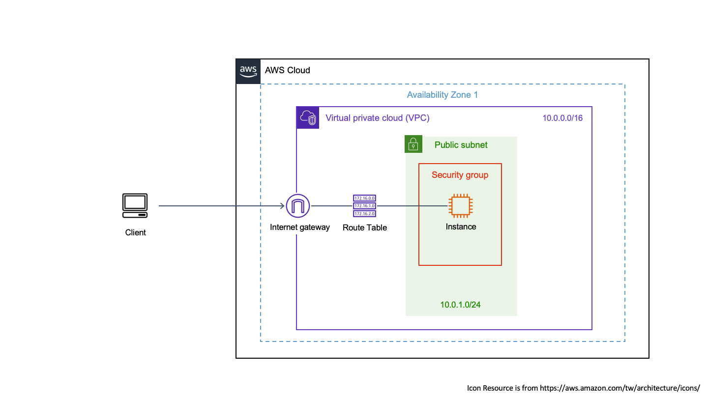

# Terraform Practice Repo

* `try-aws`: launch aws service with one ec2 with one vpc, one subnet, one igw and one routing table, and serve a web page by Nginx
* `try-docker`: create a container and an image with nginx installed and allow localhost 80 to access


## Env ##

1. install [Terraform](https://developer.hashicorp.com/terraform/downloads)
2. install aws cli (required for `try-aws` folder)

### Others

For aws related practices, we need a aws "default" profile in local env.

1. prepare "default" profile
2. touch and edit ~/.aws/credentials
3. fill in these configs, like:

```
[default]
  # aws_access_key_id=
  # aws_secret_access_
  # and run command: "aws configure" in terminal
```

4. exec `aws credentials`

5. create key pair for aws instance (**AWS only supports RSA keypairs, it does not support DSA, ECDSA or Ed25519 keypairs**)

  ```bash
  ssh-keygen -f <output_keyfile>
  # output_keyfile is just like the value in variable.tf (variable aws_intance_public_key)
  ```

  ```bash
  chmod 400 <output_keyfile>
  ```

#### Notes

ssh into ec2 (must define output "public_ip" in outputs.tf)

```bash
cd try-aws

ssh ubuntu@$(terraform output -raw public_ip) -i ./us-west-1-region-key-pair
```

## Common commands ##

[offical website](https://developer.hashicorp.com/terraform/cli/commands)

- `terraform init` donwload providers and modules listed in configuration file.
- `terraform fmt` help you format .tf files.
- `terraform validate` help you validate .tf file (not includes validate values is valid or not).
- `terraform plan` preview execution plan.
- `terraform apply` execute plan.
- `terraform apply -auto-approve` execute plan without answer yes or no.
- `terraform apply -refrest-only`
- `terraform apply -replace="<resource>.<name>"` (e.g terraform apply -replace="aws_instance.web_server")
- `terraform show` view current state in remote.
- `terraform apply -destroy` destroy all remove objects.
- `terraform output`


## Diagrams ##

1. Diagram of try-aws practice

  * Serve a web page in ec2
  * allow public access (IGW + Security group: 80 port and 22 port)
  * 1 VPC, 1 public subnet, 1 custom routing table.

  

### Troubleshooting

1. issue1

Q:

```
Error: creating EC2 Instance: MissingInput: No subnets found for the default VPC 'vpc-xxxxx'. Please specify a subnet.
```

Resolve:

```
aws ec2 create-default-subnet --availability-zone <Region: e.g us-west-1b>
```


2. issue 2

Q:

```
Error: Error pinging Docker server: Cannot connect to the Docker daemon at unix:///var/run/docker.sock. Is the docker daemon running?
```

Resolve: 

1. exec `docker context ls`, and look there and copy `DOCKER ENDPOINT` info

2. copy and paste it in `provider "docker" { host: ""}`


